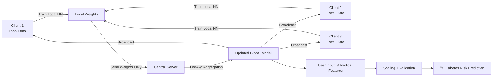

<div align="center">

# 🩺 FedDiabetes — Federated Learning for Diabetes Prediction

### Privacy-first diabetes risk prediction powered by Federated Averaging (FedAvg)

[](https://www.python.org/)
[](https://www.tensorflow.org/)
[](https://keras.io/)
[](https://scikit-learn.org/)
[](https://pandas.pydata.org/)
[](https://numpy.org/)
[](https://matplotlib.org/)

[](LICENSE)
[](#)
[](#)

<br/>

*A decentralized, privacy-preserving AI system that predicts diabetes risk without ever moving raw patient data off-site.*

[Overview](#-overview) •
[Architecture](#%EF%B8%8F-system-architecture) •
[Tech Stack](#-tech-stack) •
[Results](#-results) •
[Quick Start](#-quick-start) •
[Roadmap](#%EF%B8%8F-roadmap)

</div>

---

## 📖 Overview

**FedDiabetes** simulates a real-world hospital network where patient data can never leave its origin — yet a single, smart, shared model still gets trained collaboratively.

Instead of centralizing the **PIMA Indians Diabetes Dataset** in one place, the project partitions it across **3 simulated clients**. Each client trains a local neural network independently. Only the **model weights** — never the raw data — are shared with a central server, which aggregates them using **Federated Averaging (FedAvg)**. The result: a global model that performs *better* than any centrally-trained model, while keeping every patient record private.

> 🔐 **Core idea:** *Bring the model to the data, not the data to the model.*

| | |
|---|---|
| 🎓 **Institution** | IILM University |
| 👤 **Author** | Nitish Kumar Singh (CS-2341726, 3CSE1) |
| 🧪 **Domain** | Healthcare AI / Privacy-Preserving ML |
| 🧰 **Type** | Federated Learning Simulation |

---

## 🎯 Objectives

- 🛡️ Build a privacy-preserving diabetes prediction model
- 🤝 Simulate federated learning across multiple healthcare "clients"
- 📈 Improve model accuracy & generalization vs. centralized training
- ⚡ Provide real-time, on-demand diabetes risk predictions

---

## 🤔 Why Federated Learning?

| Centralized ML | Federated Learning |
|---|---|
| ❌ Raw data leaves the source | ✅ Raw data never moves |
| ❌ Single point of privacy failure | ✅ Privacy preserved by design |
| ⚠️ Hard to scale across hospitals | ✅ Natural multi-hospital collaboration |
| ⚠️ Regulatory/compliance risk | ✅ HIPAA/GDPR-friendly architecture |

---

## 🏗️ System Architecture



**Pipeline steps:**
1. Load & preprocess the PIMA dataset (`StandardScaler`)
2. Partition data across 3 clients
3. Each client trains a local copy of the model
4. Server aggregates weights via **FedAvg**
5. Global model is updated and redistributed
6. Repeat for 20 communication rounds
7. Final model serves real-time predictions

---

## 🧰 Tech Stack

<div align="center">

| Layer | Technology |
|---|---|
| **Language** |  |
| **Deep Learning** |   |
| **ML Utilities** |  |
| **Data Handling** |   |
| **Visualization** |  |
| **Dataset** | PIMA Indians Diabetes Dataset (UCI / Kaggle) |
| **Algorithm** | Federated Averaging (FedAvg) |
| **Version Control** |   |

</div>

---

## 🧬 Dataset

**PIMA Indians Diabetes Dataset** — 768 patient records, 8 medical features:

| # | Feature | Description |
|---|---|---|
| 1 | `Pregnancies` | Number of pregnancies |
| 2 | `Glucose` | Plasma glucose concentration |
| 3 | `BloodPressure` | Diastolic blood pressure (mm Hg) |
| 4 | `SkinThickness` | Triceps skinfold thickness (mm) |
| 5 | `Insulin` | 2-Hour serum insulin (mu U/ml) |
| 6 | `BMI` | Body mass index |
| 7 | `DiabetesPedigreeFunction` | Genetic diabetes likelihood score |
| 8 | `Age` | Age in years |
| 🎯 | `Outcome` | 0 = Non-diabetic, 1 = Diabetic |

---

## 🧠 Model Architecture

```
Input Layer (8 features)
        │
Dense(32, activation="relu", L2 regularization)
        │
Dropout(0.5)
        │
Dense(16, activation="relu", L2 regularization)
        │
Dropout(0.5)
        │
Dense(1, activation="sigmoid")  ──▶  Diabetes Probability
```

| Hyperparameter | Value |
|---|---|
| Optimizer | Adam |
| Loss Function | Binary Cross-Entropy |
| Aggregation | Federated Averaging (FedAvg) |
| Communication Rounds | 20 |
| Local Epochs / Round | 5 |
| Batch Size | 32 |
| Simulated Clients | 3 |

---

## 📊 Results

<div align="center">

| Model Type | Accuracy | Privacy Level | Notes |
|:---:|:---:|:---:|---|
| Non-Federated | **61.69%** | 🔴 Low | Centralized data training |
| **Federated Model** | **75.32%** | 🟢 High | Distributed training, improved generalization |

</div>

> 📈 **+13.63% accuracy improvement** while keeping all client data fully local — proof that privacy and performance aren't mutually exclusive.

---

## 🚀 Quick Start

### 1️⃣ Clone the repository

```bash
git clone https://github.com/<your-username>/feddiabetes.git
cd feddiabetes
```

### 2️⃣ Set up environment

```bash
python -m venv venv
source venv/bin/activate      # On Windows: venv\Scripts\activate
pip install -r requirements.txt
```

### 3️⃣ Add the dataset

Place `diabetes.csv` (PIMA Indians Diabetes Dataset) in the project root.

### 4️⃣ Run the project

```bash
python diabetes_federated.py
```

The script will:
- ✅ Train & evaluate non-federated client models
- ✅ Run 20 rounds of federated learning across 3 clients
- ✅ Prompt for 8 medical inputs and return a real-time risk prediction
- ✅ Save the trained model to `models/federated_diabetes_model.keras`
- ✅ Plot a Federated vs. Non-Federated accuracy comparison chart

### Example Run

```text
🚀 Starting Diabetes Federated Learning Project...

--- 🧠 Non-Federated Training ---
Client 1 Accuracy: 63.50%
Client 2 Accuracy: 60.25%
Client 3 Accuracy: 61.32%

--- 🌐 Federated Learning ---
✅ Round 1 completed.
...
✅ Round 20 completed.
✅ Federated Learning Test Accuracy: 75.32%

Enter the following values:
Pregnancies: 2
Glucose: 130
Blood Pressure: 70
Skin Thickness: 25
Insulin: 100
BMI: 28.5
Diabetes Pedigree Function: 0.45
Age: 35

Raw Prediction (sigmoid): 0.6123
Predicted Diabetes Risk: 100%
💾 Model saved at: models/federated_diabetes_model.keras
```

---

## 📁 Project Structure

```
feddiabetes/
├── 📄 diabetes_federated.py        # Main federated learning pipeline
├── 📊 diabetes.csv                 # PIMA Indians Diabetes Dataset
├── 📁 models/                      # Saved Keras models (generated at runtime)
├── 📋 requirements.txt             # Python dependencies
├── 🙈 .gitignore
└── 📘 README.md
```

---

## 📦 requirements.txt

```
tensorflow>=2.12
numpy
pandas
scikit-learn
matplotlib
```

---

## 🗺️ Roadmap

- [ ] 🔐 Add differential privacy / secure aggregation
- [ ] 🧪 Support non-IID and configurable client splits
- [ ] 🌐 Build a Flask/FastAPI inference API
- [ ] 📱 Deploy a web/mobile front-end for real-time predictions
- [ ] ❤️ Extend to other diseases — heart disease, CKD, etc.
- [ ] ☁️ Containerize with Docker for reproducible deployment

---

## 🤝 Contributing

Contributions, issues, and feature requests are welcome!

1. Fork the repo
2. Create your feature branch (`git checkout -b feature/amazing-feature`)
3. Commit your changes (`git commit -m 'Add amazing feature'`)
4. Push to the branch (`git push origin feature/amazing-feature`)
5. Open a Pull Request

---

## 📄 License

This project is licensed under the **MIT License** — see the [LICENSE](LICENSE) file for details.

---

## 👤 Author

<div align="center">

**Nitish Kumar Singh**
 IILM University

[](https://github.com/nitishchauhan002)
[](https://www.linkedin.com/in/nitish-kumar-singh-4802792bb/)

⭐ If this project helped you, consider giving it a star!

</div>
